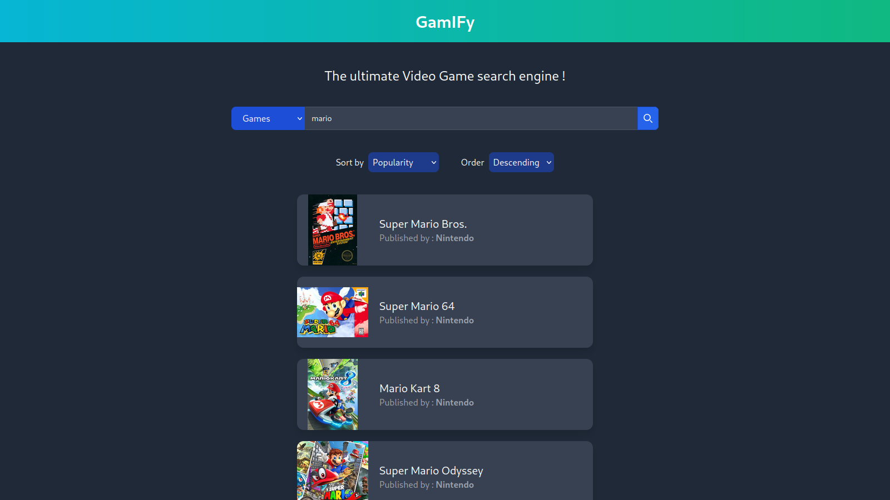

# GamIFy

A video game wiki using [DBpedia](https://www.dbpedia.org/) data, an open data graph database. It was made by 7 people, for a class on [semantic web](https://en.wikipedia.org/wiki/Semantic_Web). It uses [Svelte](https://svelte.dev/), a front-end framework.

## Pages

### Search

### Game page

### Company page

## How to run

- Install [Node.js](https://nodejs.org/en/download) (tested with version 20)
- `npm install`
- `npm run dev`
- A message appears with the localhost url

A docker image for deployment is also available.
